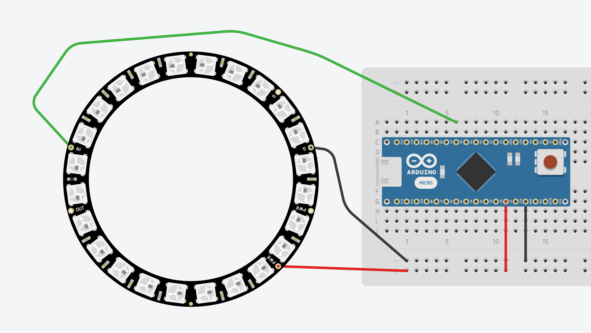

## RainbowSpin
This is a simple color ring with spinning colors. It uses Adafruit Neopixel and a Arduino micro but since it's very simple, the board model does not really matter.

## Wiring
Like on this picture, 5v to 5v, GND to GND and whatever digital pin to the ring INPUT. Here, I used pin 6.

## Coding
You need to import the [Neopixel library by Adafruit](https://github.com/adafruit/Adafruit_NeoPixel) and then, upload.

## How it looks Like
<iframe width="560" height="315" src="https://www.youtube.com/embed/_ERqZk8B3Uk" frameborder="0" allowfullscreen></iframe>
