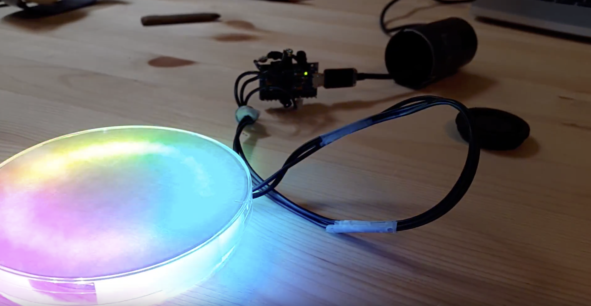

## RainbowSpin
This is a simple color ring with spinning colors. It uses Adafruit Neopixel and a Arduino micro but since it's very simple, the board model does not really matter.

## Wiring
Like on this picture, 5v to 5v, GND to GND and whatever digital pin to the ring INPUT. Here, I used pin 7.

## Coding
You need to import the [Neopixel library by Adafruit](https://github.com/adafruit/Adafruit_NeoPixel) and then, upload.

## How it looks Like
See the **[VIDEO](https://www.youtube.com/watch?v=_ERqZk8B3Uk#action=share)** on youtube.

I used a Petri dish to enclose the Neopixel part, and a analog film tube to put the Arduino. I stuck a circle-shaped piece of paper inside the top part of the dish, so that the light gets more diffused, the idea being to use it a bicycle rear light :)
